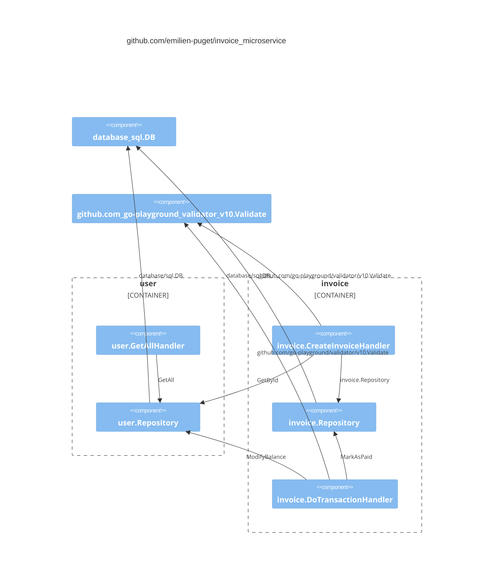

# invoice_microservice

### improvement to be done

- use a transaction to modify balance and mark as paid
- store the transaction in a ledger database
- more tests, including end to end complete scenario

### C4C uml diagram

